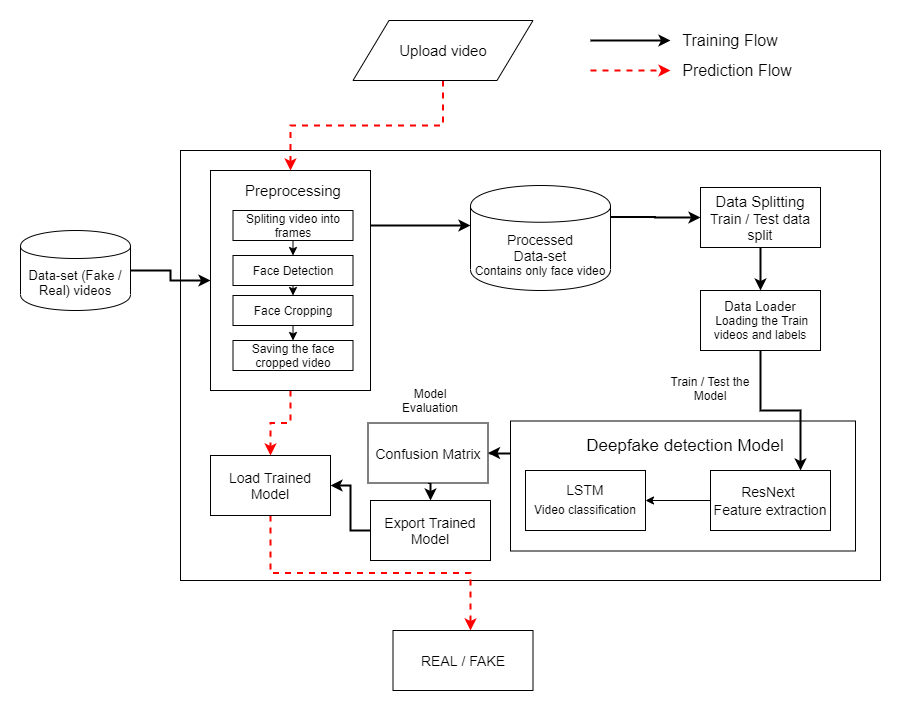
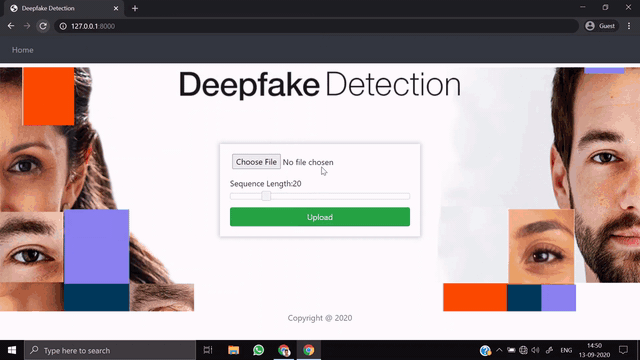

# DeepGuard — AI Deepfake Video Detection

> **Upload a video, get a REAL or FAKE verdict — powered by deep learning.**

DeepGuard is a deepfake video detection system built on deep learning. It combines a **ResNeXt-50 CNN** for per-frame feature extraction with an **LSTM** that models temporal inconsistencies between frames — the subtle frame-to-frame artifacts that give manipulated videos away. It ships as a Django web application plus a full model-training pipeline.

---

## Demo & Architecture

### How DeepGuard Works

*End-to-end pipeline: a video is split into frames, faces are detected and cropped, ResNeXt-50 extracts per-frame features, and an LSTM classifies the sequence as REAL or FAKE.*

### Detection in Action

*Frame-by-frame analysis of a video under inspection.*

---

## What is DeepGuard?

**DeepGuard is an AI-powered deepfake video detector.** A user uploads a video through the web app and chooses how many frames to analyse; the model returns a **REAL or FAKE** classification with a confidence score.

Deepfakes are increasingly used for fraud, misinformation, and impersonation. DeepGuard gives individuals, platforms, and investigators a practical tool to flag manipulated video — built on a transparent, well-understood deep-learning architecture.

It is designed for **journalists, content platforms, fact-checkers, security teams, and researchers** who need to verify whether a video is authentic.

---

## Key Features

- **REAL / FAKE classification** — upload a video and get a clear verdict with a confidence score.
- **Frame-count control** — choose 10 to 100 frames to analyse; more frames means higher accuracy.
- **ResNeXt-50 + LSTM architecture** — CNN feature extraction combined with sequence modelling of temporal artifacts.
- **Face-focused analysis** — faces are detected and cropped from every frame, so the model focuses on what matters.
- **Proven accuracy** — up to **93.59%** on a 6,000-video benchmark (see results below).
- **Web application** — a clean Django app for uploading, predicting, and reviewing history.
- **Full training pipeline** — notebooks for preprocessing, training, and prediction so you can build your own model.
- **GPU or CPU** — runs on an Nvidia GPU for speed, or on CPU.
- **Dockerized** — ships with Docker and an nginx reverse-proxy config for deployment.

---

## Accuracy Results

Trained and evaluated on a 6,000-video dataset:

| Frames Analysed | Accuracy |
|:---:|:---:|
| 10 | 84.21% |
| 20 | 87.79% |
| 40 | 89.35% |
| 60 | 90.59% |
| 80 | 91.50% |
| **100** | **93.59%** |

*More frames analysed → more temporal signal → higher accuracy.*

---

## Who It's For

| Audience | Why DeepGuard helps |
|----------|---------------------|
| **Journalists & fact-checkers** | Verify whether video evidence is authentic before publishing. |
| **Content platforms** | Flag manipulated video uploads at scale. |
| **Security & fraud teams** | Detect impersonation and synthetic-media fraud. |
| **Researchers & students** | A clear, well-documented reference implementation of video deepfake detection. |
| **Developers** | A deployable detection service with a training pipeline to customise. |

---

## How It Works

1. **Upload a video** and choose how many frames to analyse.
2. **Preprocessing** — the video is split into frames; the face region is detected and cropped from each frame.
3. **Feature extraction** — ResNeXt-50 produces a feature vector for every frame.
4. **Sequence modelling** — an LSTM reads the per-frame features as a time sequence, learning the temporal inconsistencies that betray a deepfake.
5. **Verdict** — the model returns **REAL** or **FAKE** with a confidence score.

---

## Technology

DeepGuard is built on a modern deep-learning and web stack:

- **Model:** PyTorch — ResNeXt-50 (transfer learning) + LSTM
- **Computer vision:** OpenCV, face-recognition (dlib)
- **Web application:** Django
- **Training pipeline:** Jupyter notebooks — preprocessing, training, prediction
- **Deployment:** Docker + nginx
- **Datasets used for training:** FaceForensics++, Celeb-DF, Deepfake Detection Challenge (DFDC)

> This repository is a **public showcase** with documentation, the system architecture, and a demo. The DeepGuard source code is open source under the **GNU General Public License v3.0**.

---

## Frequently Asked Questions

**What does DeepGuard detect?**
Video deepfakes — face-swapped or face-reenacted videos. It classifies an uploaded video as REAL or FAKE with a confidence score.

**How accurate is it?**
Up to 93.59% on a 6,000-video benchmark when analysing 100 frames. Accuracy scales with the number of frames analysed.

**Why ResNeXt + LSTM?**
ResNeXt-50 is a strong CNN for extracting visual features from each frame. The LSTM then models how those features change across frames — deepfakes often have subtle temporal inconsistencies a single-frame model would miss.

**Does it need a GPU?**
No. A GPU speeds up inference, but DeepGuard also runs on CPU.

**Can I train my own model?**
Yes. The project includes a full training pipeline (preprocessing, training, and prediction notebooks) and documents the public datasets used.

**Is this open source?**
Yes. DeepGuard is licensed under the GNU General Public License v3.0. This repository is a public showcase; see the license below.

**How do I get a demo or deployment help?**
See the **Contact & Demo** section below.

---

## Why DeepGuard

- 🎯 **Accurate** — up to 93.59% on a real benchmark.
- 🧠 **Sound architecture** — ResNeXt feature extraction + LSTM temporal modelling, not a black box.
- 🌐 **Deployable** — Django web app, Dockerized, GPU or CPU.
- 🔬 **Reproducible** — full training pipeline and documented datasets.
- 🆓 **Open source** — GPLv3 licensed.

---

## Contact & Demo

Interested in deploying DeepGuard, integrating deepfake detection, or a custom build? Get in touch.

| Developer | Email | WhatsApp |
|-----------|-------|----------|
| **Muhammad Maaz** | [mazwaseem098@gmail.com](mailto:mazwaseem098@gmail.com) | [+92 323 7609712](https://wa.me/923237609712) |
| **Muhammad Tanveer** | [mtanveertahir66@gmail.com](mailto:mtanveertahir66@gmail.com) | [+92 320 6688665](https://wa.me/923206688665) |

- **Company:** [Advenno](https://advenno.com)
- **GitHub:** [@maaz-gobi](https://github.com/maaz-gobi)

We build AI products and custom software — reach out to discuss your use case, a demo, or a custom build.

---

## License

DeepGuard is open source under the **GNU General Public License v3.0** — see [LICENSE](LICENSE). It is a derivative work built on prior GPLv3-licensed code and is distributed under the same license. Copyright remains with the original authors and contributors under the terms of the GPLv3.

---

**Keywords:** deepfake detection, deepfake video detection, AI deepfake detector, ResNeXt LSTM deepfake, deep learning video forensics, fake video detection, synthetic media detection, FaceForensics, Celeb-DF, DFDC, PyTorch deepfake model, Django deepfake app, video manipulation detection, face swap detection, DeepGuard, Advenno.
